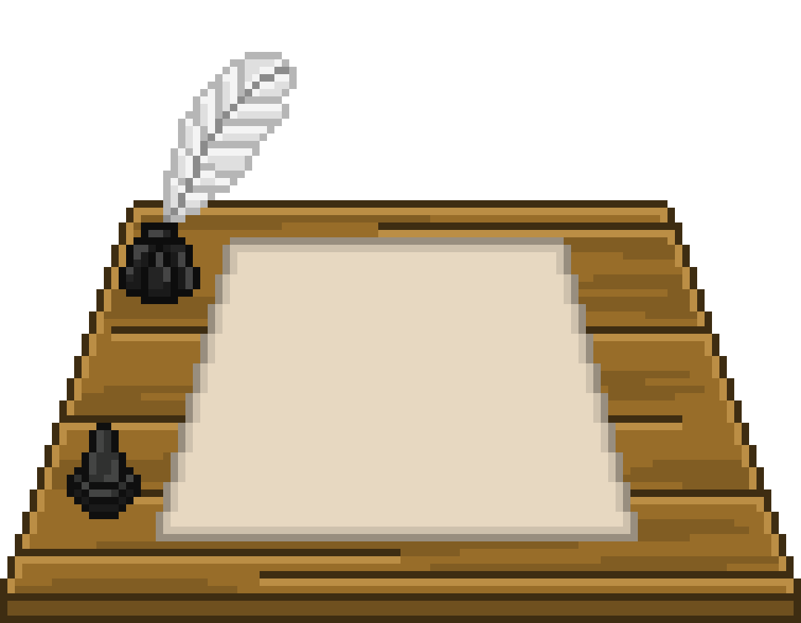

<h1> 𝙷𝚒, 𝙸'𝚖 𝙸𝚠𝚊𝚔𝚒!  </h1>

*𝙷𝚒𝚐𝚑 𝚜𝚌𝚑𝚘𝚘𝚕 𝚜𝚝𝚞𝚍𝚎𝚗𝚝 𝚊𝚝* ***𝙹𝚎𝚊𝚗 𝙼𝚘𝚞𝚕𝚒𝚗*** <br>
***𝙲𝚢𝚋𝚎𝚛 𝚜𝚎𝚌𝚞𝚛𝚒𝚝𝚢*** *𝚎𝚡𝚙𝚎𝚛𝚝 𝚙𝚛𝚘𝚓𝚎𝚌𝚝*

<table>
  <tr>
    <td style="border: none;>
      
      <br>
      
      
    </td>
    <td style="border: none;>
      <a href="https://spotify-github-profile.kittinanx.com/api/view?uid=312vumjunxfclcygvl5srhi6iyii&redirect=true">
        
      </a>
    </td>
  </tr>
</table>


###  𝙰 𝚕𝚒𝚝𝚝𝚕𝚎  𝚖𝚘𝚛𝚎 𝚊𝚋𝚘𝚞𝚝 𝚖𝚎...

```ts
const iwaki = {
  pronouns: "he" | "him",
  code: ["Java", "C", "C++", "Rust"],
  tools: ["IntelliJ IDEA", "VSCode", "Tauri", "CMake"],
  architecture: ["low-level", "cross-platform", "modular design"],
  projects: {
    library: "Minimal UI library in C",
    consoleApp: "SSH connection and simplified docker commands",
    school: "Epistemology & computer science student"
  },
  interests: ["Anime", "Philosophy", "Game dev", "UI/UX design"],
  challenge: "Currently building a minimal UI library from scratch"
}
```

---