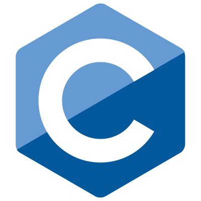
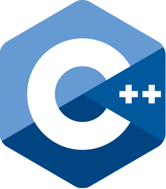
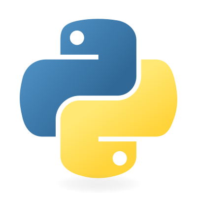
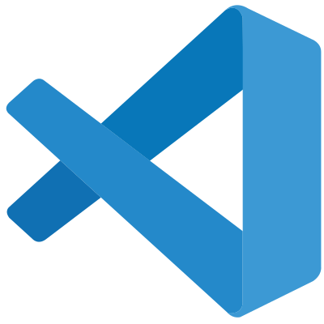
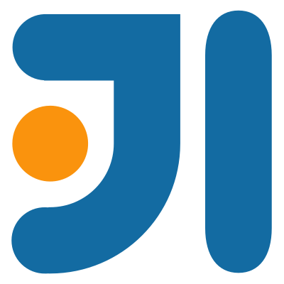
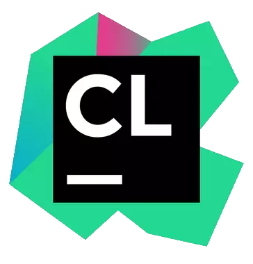

    <h1> Iwaki - Un developpeur pas comme les autres </h1>

<h2> 👋 Présentations</h2>

- 🇫🇷 Français
- 🖥️ Passionné de développement informatique
- 🐲 J'aime les dragons
- 🌸 <b>Actuellement entrain de travailler sur <a href="https://kanawa.fr">Kanawa</a></b>
- ♨️ Développeur ***Java***
- 🧠 En train d'apprendre ***C***, ***C++***
- 🧩 Veux apprendre ***Python***, ***Rust***

## ✨ Compétences & 🔧 Outils

### Acquis

### En apprentissage

### Veux apprendre

### Outils préférés

    <h2>Réseaux</h2>

