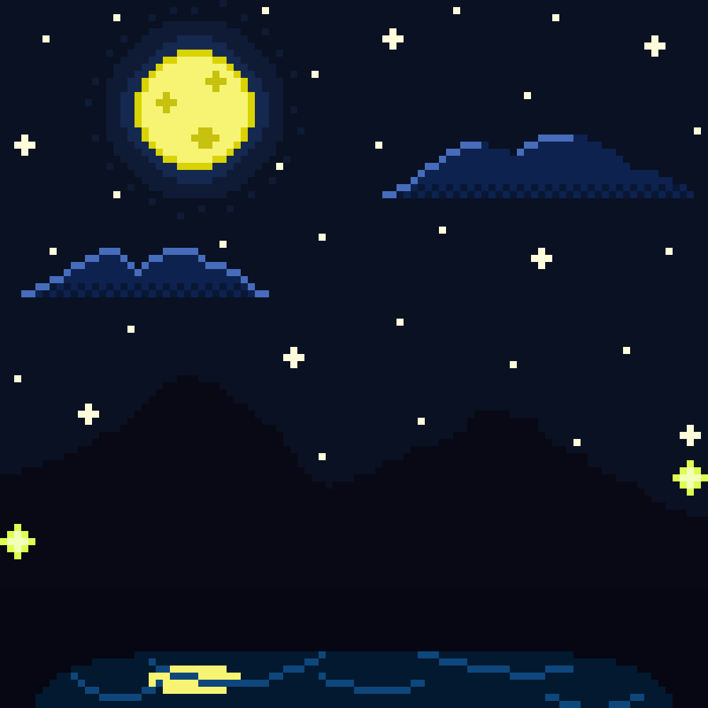
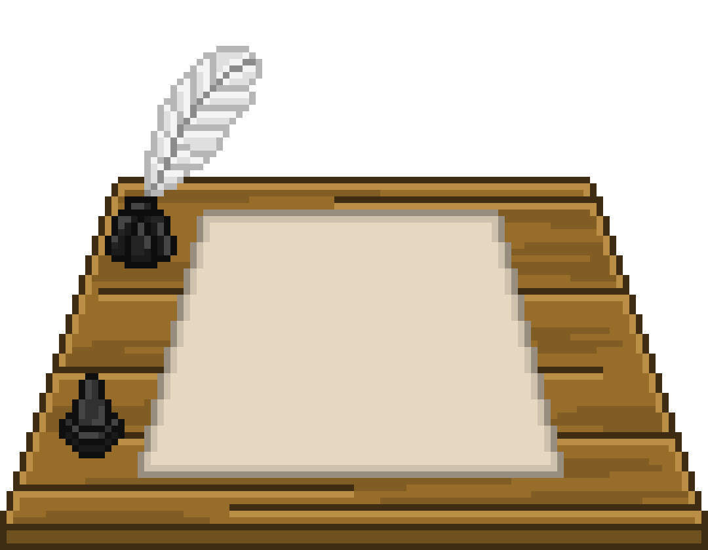

<h1> 𝙷𝚒, 𝙸'𝚖 𝙸𝚠𝚊𝚔𝚒!  </h1>

*𝙷𝚒𝚐𝚑 𝚜𝚌𝚑𝚘𝚘𝚕 𝚜𝚝𝚞𝚍𝚎𝚗𝚝 𝚊𝚝* ***𝙹𝚎𝚊𝚗 𝙼𝚘𝚞𝚕𝚒𝚗*** <br>
***𝙲𝚢𝚋𝚎𝚛 𝚜𝚎𝚌𝚞𝚛𝚒𝚝𝚢*** *𝚎𝚡𝚙𝚎𝚛𝚝 𝚙𝚛𝚘𝚓𝚎𝚌𝚝*

<div align="center">
  <table>
    <tr>
      <td>
         <br/>
         <br/>
        
        <a href="https://anilist.co/user/Iwaki/" target="_blank"    rel="noopener noreferrer">
         
        </a>
        <a href="https://open.spotify.com/user/31k6rxzyncflvurxps2w2vqgmggm">
        
        </a> <br/>
        <a href="https://steamcommunity.com/id/iwaki_">
        </a>
      </td>
      <td>
        <a href="https://spotify-github-profile.kittinanx.com/api/view?uid=31k6rxzyncflvurxps2w2vqgmggm&redirect=true">
          
        </a>
      </td>
    </tr>
  </table>

  <br>
  
</div>

-- --

###  𝙰 𝚕𝚒𝚝𝚝𝚕𝚎  𝚖𝚘𝚛𝚎 𝚊𝚋𝚘𝚞𝚝 𝚖𝚎...

```ts
const iwaki = {
  pronouns: "he" | "him",
  code: ["Java", "C", "C++", "Rust", "Python"],
  tools: ["IntelliJ IDEA", "VSCode", "Cargo", "CMake"],
  architecture: ["low-level", "cross-platform", "modular design"],
  projects: {
    rll: "Download and launch minecraft in Rust",
    leif: "Minimal UI library in C",
    aria: "SSH connection and simplified docker commands",
    school: "Epistemology & computer science student"
  },
  interests: ["Anime", "Philosophy", "Game dev", "UI/UX design"],
  challenge: "Currently building a minimal UI library from scratch"
}
```

---
